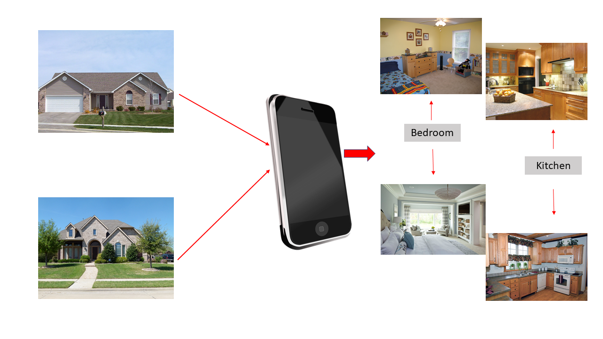
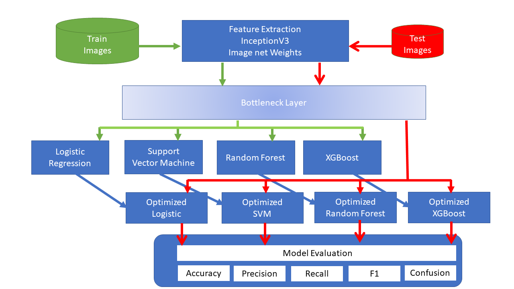
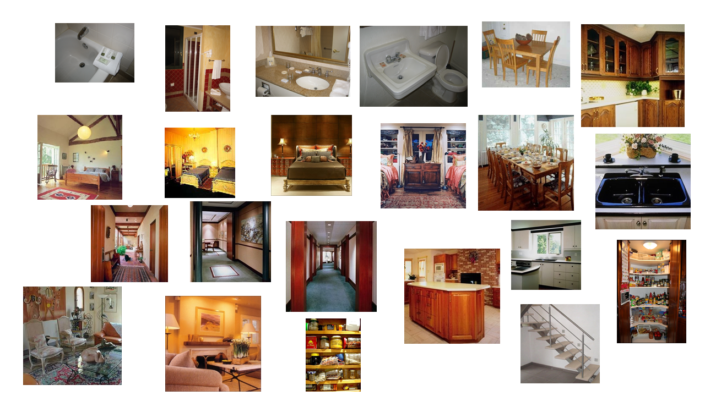
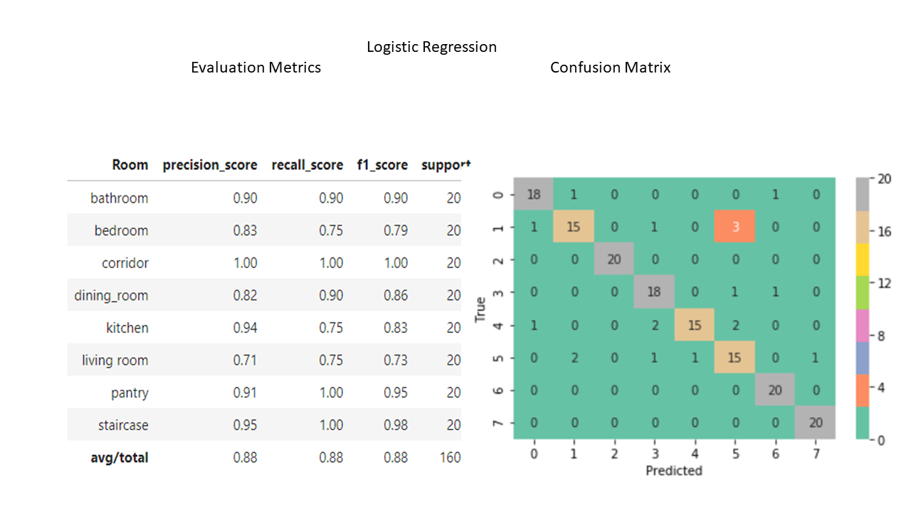
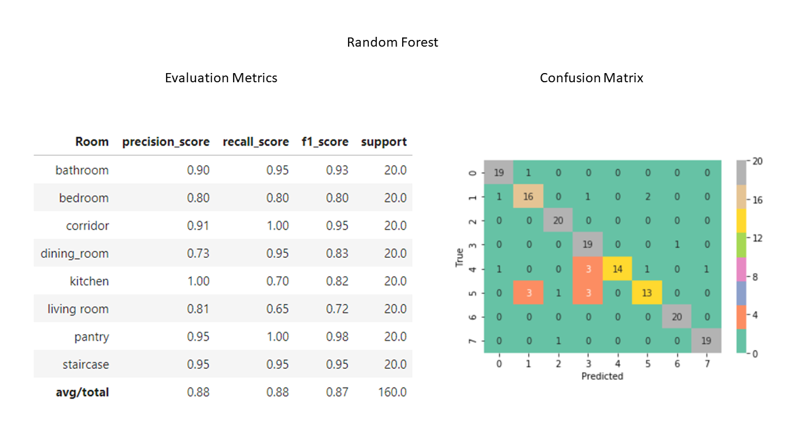
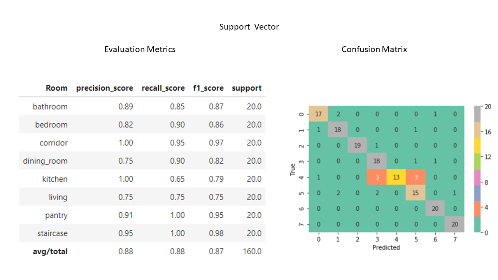
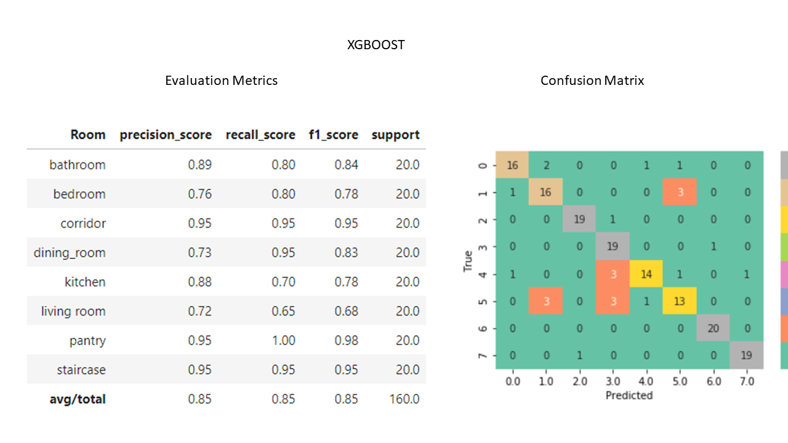

### Introduction

Vacation Time!! I wish!! As the summer comes to an end I think back to our family vacation by the beach. In planning for this much valued time together, I spent several hours scoring through the web for vacation rentals, looking for the idyllic place. I compared homes, their price, the location, the setting, the rooms, all with my dear family in mind. Whilst engaged thus, I wondered how one would build a visual image classifier to classify the different rooms in a home. It would probably help not only vacation home renters and rental agencies but also in real estate. Instead of laboriously manually labeliing every photo, with a image classifier the photos would automatically be sorted into the right category to be displayed as needed. So here is what is envisaged:
 


Think of a  situation where one has visited many homes and have clicked many fotos, instead of manually labelling your fotos you are able to pass them through a classifier that automatically labels them into the category of room. 

So how would one go about building such a classifier:

Option 1: 

Build a classifier from scratch by building a deep learning neural network called a Convolutional Neural Network. This would require atleast a 1000 images per category and extensive computation resources and time. 

Option 2: 

As building a custom deep learning model from scratch, requires extensive computation resources and lots of training data a second option easier on resources and useful where one has fewer images is transfer learning. Using transfer learning one can use a model already built to extract the features of the images. One such model is the Inception V3 model built by the Google Brain team for the ImageNet Visual Recognition Challenge. This model is available in Keras and could be used  not as a classifier but to extract the features of the images. Once the features are extracted a classfier could be built by means of machine learning. 

Here we will use option 2. The following diagram outlines the steps involved in building the classifier. 




Images for training and testing the model:

A total of 150 for each of the room categories bathroom, bedroom, corridor, dining room, kitchen, living room,pantry and staircase were obtained from http://web.mit.edu/torralba/www/indoor.htmljmj3206. 
Twenty of these images were reserved in a folder to test the model and the other 130 images per room category were used to build the model. 

Here are a few of the images :



#### Feature Extraction Using Inception V3:

We first use the following code to get the model, along with the pre-trained weights that are the same as that of the imagenet model and store it in a variable called base_model. We also specify that the images be resized to ( 299, 299, 3).

```python

from keras.applications.inception_v3 import InceptionV3

base_model = InceptionV3(include_top=True, weights='imagenet', input_tensor=Input(shape=(299,299,3)))

```
The final layer of the network is a fully connected layer that separates out the 1000 different object categories in the ImageNet database. The following code save the neural net without the final layer in a new variable called model.

```python
base_model = InceptionV3(include_top=True, weights=weights, input_tensor=Input(shape=(299,299,3)))
model = Model(input=base_model.input, outputs=base_model.get_layer('avg_pool').output)
image_size = (299, 299)

```
This new model will no longer return a predicted image class, since the classification layer has been removed; however, the CNN now stored in model still provides us with a useful way to extract features from images. By passing each of the images through this model, we can convert each image from its 299x299x3 array of raw image pixels to a vector with 2048 entries. In practice, this dataset of 2048-dimensional points is referred to as InceptionV3 bottleneck features. These features along with its labels are stored locally using HDF5 file format. The full code for this is stored in the github repository: link to repo.

Training A Machine Learning Model: The features and labels extracted by means of the inception v3 model can now be used to train a machine learning classfier. We trained the following models and finetuned the parameters. For details see the jupyter book for each model.

1. Logistic
2. Random Forest
3. Support Vector Machines
4. XGBOOST


Testing the Models:
The fine tuned models using the training data was next evaluated using the test images. The Evaluation Metrics and the confusion matrix for each of the above fits are given below.

#### Evaluation Metrics











